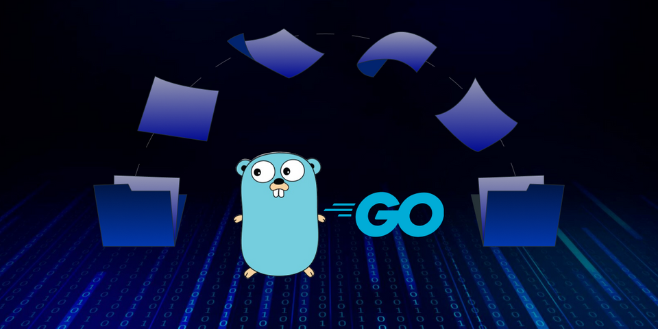

# Greenlight

Greenlight — это RESTful API приложение для создания, хранения и просмотра информации о фильмах, основанное на книге **"Let's Go Futher"**.



## Оглавление
- [Технологии](#технологии)
- [Функциональность](#функциональность)
- [Установка и запуск](#установка-и-запуск)
- [Конфигурация](#конфигурация)
- [Использование API](#использование-api)
- [Структура проекта](#структура-проекта)

## Технологии

- **Go** — язык программирования для серверной разработки.
- **PostgreSQL** — база данных для хранения информации о фильмах и пользователях.
- **Justinas Alice** — для создания цепочек middleware.
- **go migrate** - для осуществления миграций
- **go-mail/mail/v2** - для отправки сообщений об активации аккаунта на почтовый ящик

## Функциональность

Greenlight API предоставляет следующие возможности:
- **Управление фильмами**: создание, обновление, удаление и просмотр информации о фильмах.
- **Регистрация пользователей**: создание и активация учетных записей через email.
- **Аутентификация и авторизация**: создание токенов для доступа к защищенным маршрутам.
- **Мониторинг и логирование**: система метрик с поддержкой экспорта для Prometheus.
- **Ограничение частоты запросов**: защита от чрезмерного количества запросов.

## Настройка переменных окружения
Для запуска проекта скопируйте файлы и внесите изменения:
```bash
cp envrc.example .envrc
cp env.example .env
```
Необходимо изменить user на имя пользователя, password на пароль, database_name на имя базы данных

## Просмотр доступных команд:
Чтобы увидеть все доступные команды в Makefile, используйте:
```bash
make help
```

## Осуществление миграций:
Перед запуском проекта требуется осуществить миграцию бд
```bash
make db/migrations/up
```

## Запуск проекта:
Для запуска проекта используйте:
```bash
make run/api ARGS="-port=8080"
```
Или
```bash
make docker/image
make docker/run
```
